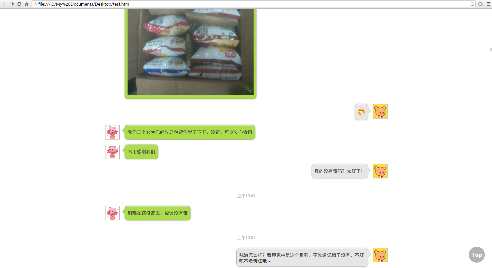

WeChatToHTML
============
Extract `text`, `image`, `audio`, and `video` info from WeChat SQLite db
and user content folder, generate **WeChat app style HTML5 files**.

Why there is no source code here?
---------------------------------
Since WeChat is a commercial software, I am not yet sure if there will be
any **legal risk** if I release the code which uses it's user data.

So I decided to remove all the source code. I will consider releasing the
code in the future. ^_^

Demo
----
#### Overview of my implementation

#### Some details

- You can see that `text message`, `emoji`, and `images` can be displayed
  normally.

- `Audios` can be played with HTML5 audio player provided by browsers
  (Firefox, Chrome, etc.)
- The background of `date infomation` is white bar.
- Text of `time information` uses light grey color.

- `Emoji` can be displayed **inline with other text**.

- If you click `text message`, you can see the enlarged version of it,
  along with `datetime information`.
- If you click user `avatar`, you can see enlarged version of avatar.
- If you click an `image`, you can see enlarged version of image.
  You can **zoom in** or **zoom out** as you wish.

Implementation
--------------

First, get WeChat `SQLite db file` and `user content folder` from mobile phone.

For Android, you can get your `EnMicroMsg.db` from this path:

     /data/data/com.tencent.mm/MicroMsg/de42c....8ed(32 chars length)/

This is an **encrypted SQLite db file**. You need to get the `IMEI` of your mobile
phone and your WeChat `UIN` (**password=md5(IMEI+UIN)[:7]**).

Then, execute:

    echo -n "$imei$uin" | md5sum | cut -c -7

Say the password of your `EnMicroMsg.db` is abc1234. Now you need to decipher
your db file. You can use sqlcipher2 (not 3 or newer).

After deciphering, you can now access your text message, user list, datetime
informations, media path, ... from db file. All the informations we need are known.

Now you can get your media files, attachment files, and other files in this
path:

    sdcard/Tencent/MicroMsg/de42c....8ed(32 chars length)/

Normally we will need these folders: `emoji`, `image`, `image2`, `video`,
`voice`...

Then we can start design our webpage.

Using HTML5 is much more convenient since
we can play some audio and video types directly in web browser. Since the audio
format `.amr` in `voice` folder is not supported by most web browsers, we can
convert them to `.mp3` format using ffmpeg. You can do similar things for
other media type.

    ffmpeg -i ./file.amr ./file.mp3

We need to parse contents from SQLite db file.

    msgId
    msgSvrId
    type
    status
    isSend
    isShowTimer
    createTime
    talker
    content
    imgPath
    reserved
    lvbuffer
    transContent
    ...

Now we need to concentrate on type.

        1        Normal text message
        3        Photos

                    # How the photo folder organize:
                    if image_path.startswith("THUMBNAIL_DIRPATH"):
                        image_name = image_path.split('//')[1]\
                            .replace('th_', '').strip()
                        image_path = os.path.join(
                            'image2',
                            '%s/%s/%s' % (image_name[:2],
                                          image_name[2:4], image_name))

                    ...

        34       Audios (.amr)
        47       Emoji
        43       Image (jpg)
        62       Video (%H%M%S%d%m%Y******.mp4)
        1048625  image
